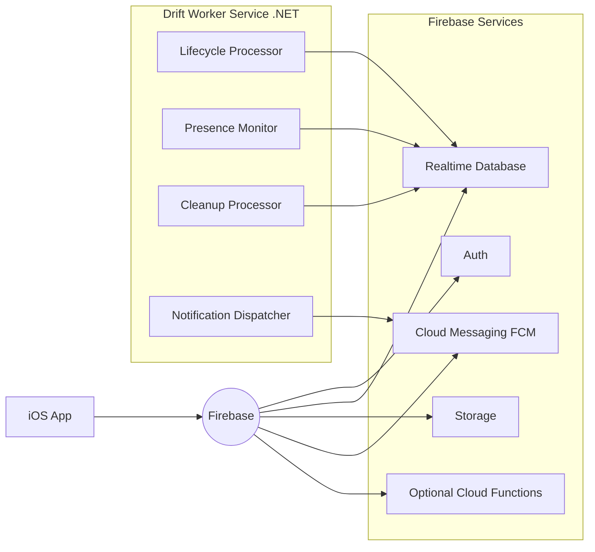
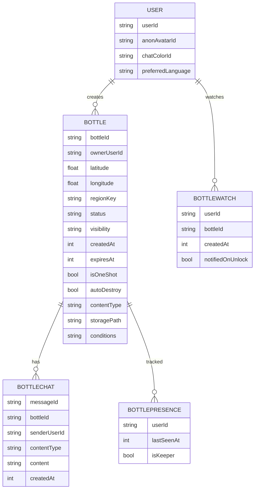
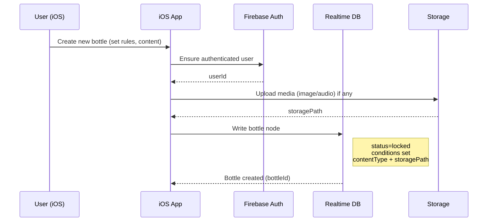
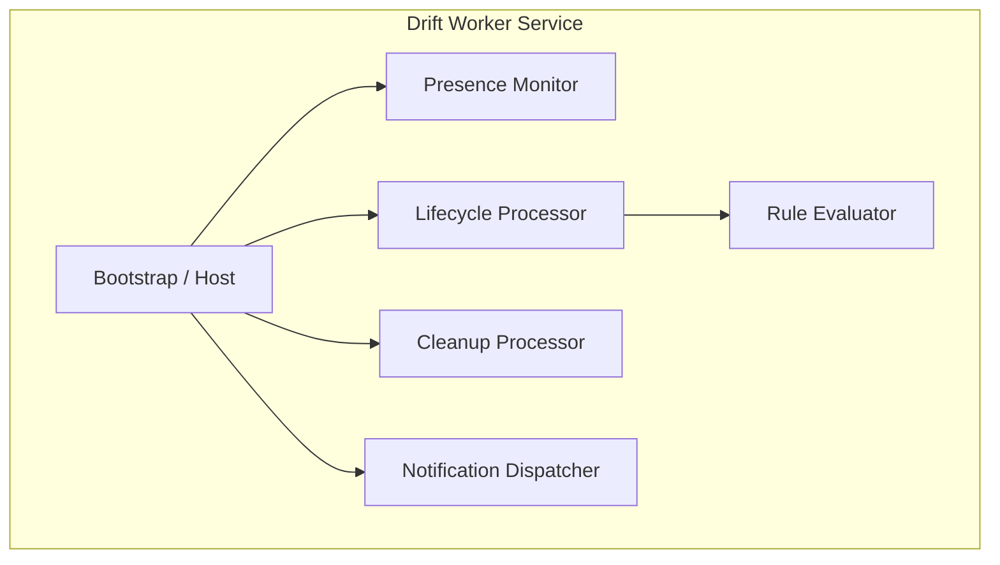
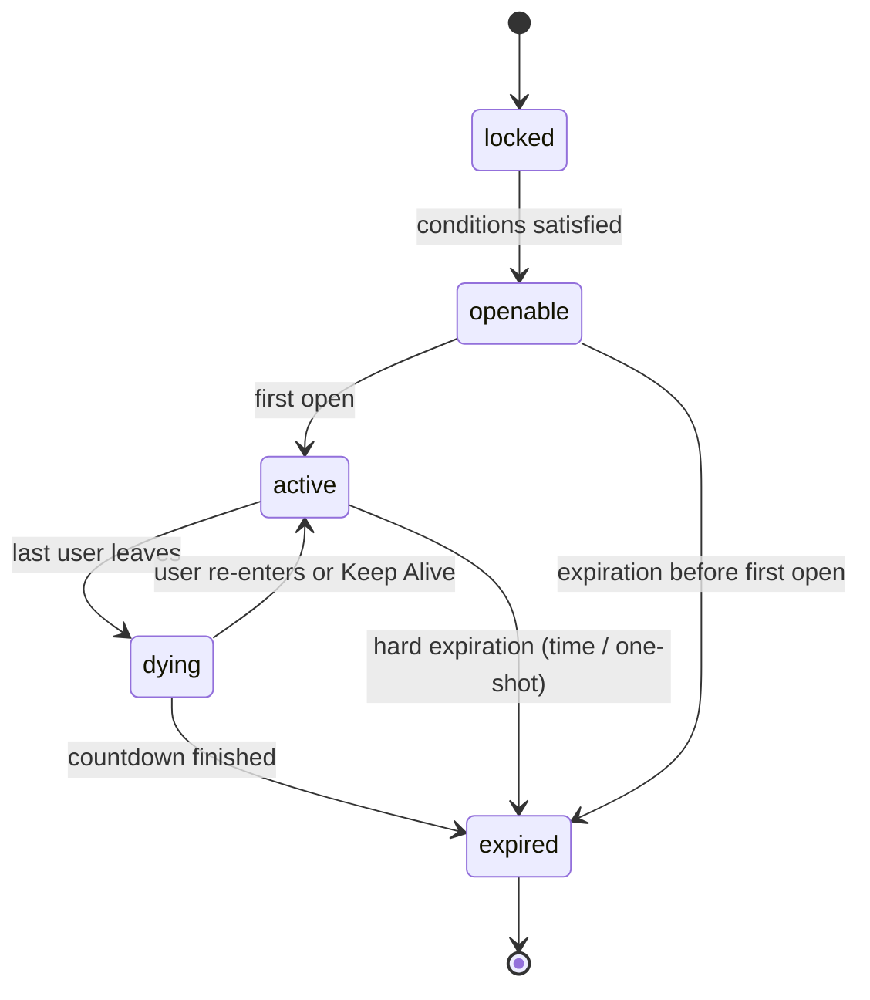
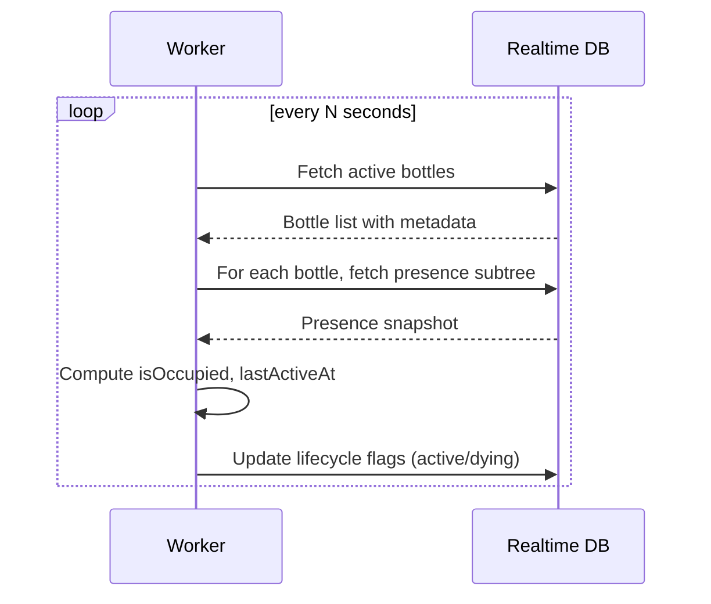
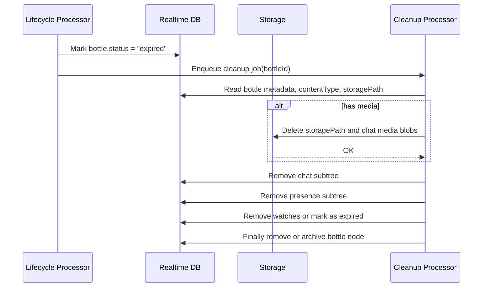
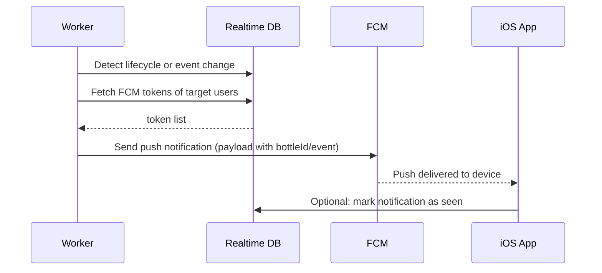
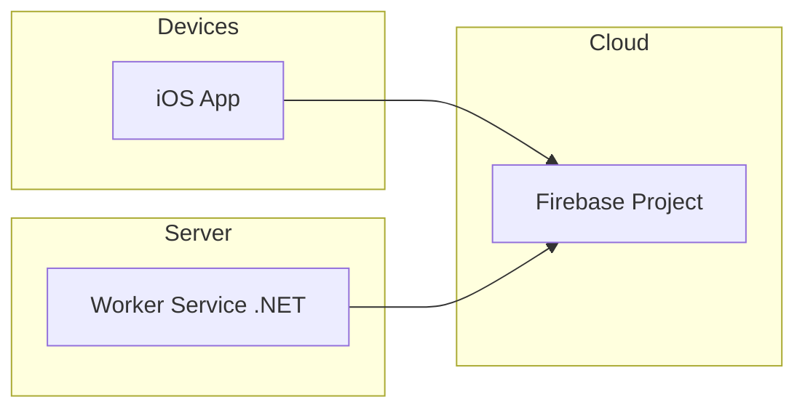

# Drift

### Send a message in the sea

Drift is an experimental geo-enhanced communication system built around the **Drift Bottle**, a rule‑driven and ephemeral object that can be discovered anywhere on Earth. Every bottle contains content and a built‑in chat space that only becomes accessible once the bottle is opened.

This document presents the concept, mechanics, and user-facing systems of Drift.

------

## 1. Core Concept

A **Drift Bottle** is a digital object placed on a real-world map. It can contain text, images, or a short audio whisper. Every bottle includes an ephemeral chat where users can react, comment, or engage in a full conversation if the bottle remains alive.

Bottles are governed by opening conditions (passwords, weather rules, time windows, and more). They are anonymous by default and disappear once their lifecycle completes.

------

## 2. Bottle Placement

### 2.1 Random Placement

The system selects a random land coordinate within a chosen region (world, continent, countries), weighted toward populated zones.

### 2.2 Manual Placement

The user selects any point on the global map.

### 2.3 Nearby Placement

The bottle is dropped near the user's current GPS location.

------

## 3. Opening Conditions

Bottles remain locked until all defined rules evaluate to true. Supported conditions include:

- Password phrase
- Time-of-day or date conditions
- Weather requirements
- Exact coordinate presence
- Distance-based rules
- Unlock after delay
- One-shot unlock
- Automatic expiration

------

## 4. Bottle Content

A bottle may contain:

- Text
- Image
- Audio whisper (2–5 seconds)
- Built‑in ephemeral chat

Content is only revealed after the bottle is opened.

------

## 5. Ephemeral Chat System

All bottles include a chat space. This is not optional.

### Chat Properties

- Anonymous by default.
- Users have no profile name or identity field.
- Users may reveal any detail voluntarily through messages.
- Messages are auto-translated locally to the user's preferred language.

### Media in Chat

Users may post media inside the chat:

- Camera capture
- Photo library selection
- Short images or clips

Media is temporary by design. When a bottle expires or dies, all its associated content is erased.

### Participant Labels

Each participant is labeled by distance relative to the bottle:

- Local (<5 km)
- Nearby (5–50 km)
- Same Country
- Same Continent
- Global

------

## 6. Chat Lifespan and Survival Rules

Chats follow a survival lifecycle:

1. When opened, the chat gains a default lifespan of one hour.
2. As long as at least one user remains inside, the timer resets.
3. When everyone leaves, a 30‑second countdown begins.
4. Any participant may claim “Keep Alive,” becoming the bottle keeper.
5. If the countdown ends with no activity, the bottle permanently expires and all data is deleted.

The only difference between lightweight reactions and a full conversation is whether someone keeps the bottle alive.

------

## 7. Ephemeral Lifecycle and Cleanup

Bottles do not persist indefinitely. Their end-of-life depends on:

- Opening conditions
- Chat activity
- One-shot rules
- User-defined expiration timers
- Abandonment

Upon expiration, the system permanently removes:

- Chat logs
- Metadata
- Images and media
- Bottle content

------

## 8. User-Facing Interfaces

### 8.1 My Bottles

Displays:

- Created bottles
- Status (locked, unopened, active, expired)
- Editable fields before first opening
- Manual early retirement
- Notification preferences

### 8.2 Watched Bottles

Allows users to save locked bottles they cannot open yet.
 Displays:

- Conditions
- Timers
- Hints
- Notification when the bottle becomes openable

### 8.3 Identity and Representation

- No username, no display name, no profile.
- Anonymous avatars only (generated or chosen).
- A consistent chat color is assigned to each user.
- Users may voluntarily state their name via message.

### 8.4 Distance and Travel Metadata

Displays:

- Distance traveled from origin when opened
- Distance categories for each participant

------

## 9. Conditions and Hint System

Conditions are visible on the bottle detail screen. Creators may optionally include non-revealing hints or clues.

------

## 10. Safety and Anti-Spam Design

The system limits spam naturally:

- Locked bottles are invisible unless conditions are met.
- All bottles auto-expire.
- Chat requires active presence to survive.
- Anonymous identity limits misuse.
- GPS-limited local placement reduces noise.

------

## 11. Translation

All chat messages are translated automatically using on-device translation when supported. No external account or paid integration is required.

------

## 12. Feature Summary

- Global bottle drops
- Configurable opening conditions
- Built‑in ephemeral chat
- Password/time/weather/location-based locks
- Auto-translation
- Anonymous interactions
- Distance-based labeling
- Media support inside chat
- My Bottles and Watched Bottles lists
- Permanent cleanup on expiration

------

## 13. Repository Structure (placeholder)

```
/docs        – design documents, specifications, diagrams
/app         – mobile client source
/backend     – server or services
/assets      – design assets
/LICENSE     – project license
/README.md   – this file
```

------

## 14. Roadmap (high-level)

- Technical architecture
- Data models and storage
- API and backend
- Client UI flows
- Translation integration
- Condition evaluation engine
- Media handling and cleanup
- Chat subsystem
- Notifications
- Security and anti-abuse features

------

# Drift – Technical Architecture

Target stack:

- Client: iOS (Swift / SwiftUI)
- Backend services: Firebase (Auth, Realtime Database, Storage, Cloud Messaging)
- Worker service: Custom .NET (C#) backend, self-hosted on Linux

This document defines the high-level architecture and component responsibilities for Drift. It focuses only on technical structure and runtime behavior.

------

## 1. High-Level System Overview

Drift is built around three main execution environments:

1. iOS client app
2. Firebase platform services
3. Drift Worker Service (C#/.NET on Linux)

### 1.1 Component Overview



Responsibilities at a glance:

- iOS App: UI, interactions, and direct Firebase access.
- Firebase: Authentication, data storage, media storage, push infrastructure.
- Worker Service: Enforces lifecycle rules, presence-based survival, cleanup, and complex notification logic.

------

## 2. Core Data Model (Conceptual)

This section describes the main entities as stored in Firebase Realtime Database and Storage.

### 2.1 Main Entities

- `User` (anonymous account authenticated via Firebase Auth)
- `Bottle`
- `BottleChat` (messages under a bottle)
- `BottlePresence` (who is currently inside the chat)
- `BottleWatch` (user-saved bottles)
- `BottleLifecycleState` (runtime state maintained/verified by worker)

### 2.2 Conceptual Data Model Diagram



Note: The actual Firebase Realtime Database schema will be tree-structured and denormalized for reads, but these entities represent the conceptual model.

------

## 3. iOS Client Responsibilities

The iOS client is responsible for user interaction and direct interaction with Firebase.

### 3.1 Responsibilities

- Handle anonymous or pseudonymous authentication via Firebase Auth.
- Read/write bottle metadata and content references in Realtime Database.
- Upload media (cover image, audio whispers, chat media) to Firebase Storage.
- Join and leave bottle chats (presence updates in Realtime Database).
- Poll or subscribe to bottle and chat updates via Realtime Database listeners.
- Display auto-translated chat messages using on-device translation frameworks.
- Manage local state for watched bottles and My Bottles.
- Register and update FCM push tokens for the current device.

### 3.2 Client-Firebase Interaction (Bottle Creation)



------

## 4. Firebase Responsibilities

Firebase acts as the shared data and messaging backbone.

### 4.1 Auth

- Create and manage user accounts.
- Provide userId tokens to the iOS client.
- Enforce write/read rules via security rules.

### 4.2 Realtime Database

- Store bottles, chats, presence, watched bottles, and lifecycle metadata.
- Provide live subscription streams to iOS clients.
- Expose change streams for the worker service.

### 4.3 Storage

- Store media files (cover images, audio whispers, chat images/clips).
- Enforce security via storage rules (access per bottle and lifecycle).

### 4.4 Cloud Messaging (FCM)

- Deliver push notifications to iOS devices.
- Device tokens stored in DB linked to userId.

### 4.5 Optional Cloud Functions

- Lightweight triggers: e.g., send simple notifications immediately on write.
- Non-critical tasks: logging, analytics, indexing.

Critical lifecycle and survival logic remains in the Drift Worker Service, not in Functions.

------

## 5. Drift Worker Service (.NET) Responsibilities

The worker service enforces Drift’s core mechanics:

- Lifecycle rules
- Presence-based survival
- Cleanup and deletion
- Advanced notification logic

### 5.1 Internal Modules



### 5.2 Module Responsibilities

- Presence Monitor
  - Periodically scans presence trees for active bottles.
  - Computes for each bottle whether at least one user is inside.
  - Updates per-bottle `lastActiveAt` and `isOccupied` flags.
- Lifecycle Processor
  - Applies the bottle state machine.
  - Maintains countdown timers for bottles that have gone empty.
  - Marks bottles as `active`, `dying`, or `expired`.
  - Handles one-shot and expiration rules.
- Cleanup Processor
  - Physically removes expired bottles and associated data.
  - Deletes media from Firebase Storage.
  - Cleans chat messages and presence nodes.
- Notification Dispatcher
  - Sends push notifications through FCM.
  - Notifies creators and watchers on key events (first open, unlock, chat activity) respecting ephemeral rules.
- Rule Evaluator
  - Evaluates opening conditions for each bottle (time, weather, location-compatible flags).
  - Flags bottles as `openable` or `locked` for discovery computations.

------

## 6. Bottle Lifecycle State Machine

### 6.1 States

Possible states:

- `locked`: Conditions not yet met.
- `openable`: Conditions met; bottle can be opened.
- `active`: Bottle is open and chat is alive.
- `dying`: All users have left; death countdown started.
- `expired`: Bottle is permanently closed; ready for cleanup.



### 6.2 Lifecycle Enforcement

Enforcement is done by the Lifecycle Processor using data in Realtime Database:

- `conditions` subtree for each bottle
- `presence` subtree for active users
- `lifecycle` subtree (timestamps, death countdown, keeper)

------

## 7. Presence and Survival Logic

### 7.1 Presence Model in Realtime Database

Example structure:

```json
"bottlePresence": {
  "{bottleId}": {
    "{userId}": {
      "lastSeenAt": 1710000000,
      "isKeeper": true
    }
  }
}
```

- iOS app periodically updates `lastSeenAt` while the user is inside the chat.
- A user explicitly leaving the chat removes their presence node.

### 7.2 Presence Evaluation Flow



- If no presence is found for a previously active bottle, the worker transitions it to `dying` and records `deathStartsAt`.
- If a user comes back before countdown ends, state returns to `active`.

------

## 8. Expiration and Cleanup

### 8.1 Expiration Rules

A bottle becomes `expired` when any of the following conditions is true:

- Global time-based expiration reached (`expiresAt` <= now).
- One-shot bottle was opened and configured to self-destruct.
- Death countdown reached (no presence during countdown window).

### 8.2 Cleanup Flow



Cleanup guarantees that:

- No residual chat logs remain.
- Media is removed from Storage.
- Watches pointing to expired bottles are updated.

------

## 9. Notifications

### 9.1 Notification Scenarios

- Bottle creator notifications
  - First bottle open
  - New user joining the chat
  - New messages while creator is away (rate-limited)
- Watcher notifications
  - Watched bottle transitions from `locked` to `openable`

Notifications are optional and respect bottle expiration (no events after `expired`).

### 9.2 Notification Flow



The worker is responsible for:

- Deciding when to send notifications
- Avoiding duplicate notifications
- Respecting user notification preferences

------

## 10. Security and Access Control (High-Level)

- Access to bottles, chats, and presence is enforced via Firebase security rules.
- Only authenticated users can:
  - Create bottles
  - Join chats
  - Write messages
  - Watch bottles
- Workers authenticate using Firebase Admin SDK and have elevated rights restricted to server-side operations.
- Storage access is restricted to:
  - Bottle owners for creation
  - Bottle participants for reading while the bottle is active

Detailed security rules will be defined in a dedicated document.

------

## 11. Deployment Model

### 11.1 iOS App

- Distributed via the App Store.
- Configured with Firebase project credentials.

### 11.2 Firebase Project

- Single project holding Auth, Realtime DB, Storage, and FCM.
- Optional Cloud Functions for lightweight tasks.

### 11.3 Worker Service

- Deployed on Linux as a long-running service (e.g., systemd).
- Uses:
  - Firebase Admin SDK for Realtime DB, Storage, and FCM
  - Configurable polling intervals for presence and lifecycle
  - Internal timers for countdown logic



------

## 12. Summary

- iOS + Firebase cover storage, auth, and push delivery.
- The Drift Worker Service is mandatory for enforcing:
  - Bottle lifecycle
  - Presence-based survival
  - Cleanup and media deletion
  - Advanced notification scenarios

This architecture locks in the separation of concerns between:

- Client interaction
- Da


------

## Copyright

All concepts, mechanics, and ideas described in this repository are the original work of:

**Copyright © Alexandre Emond. All rights reserved.**

No reproduction or redistribution without permission.
