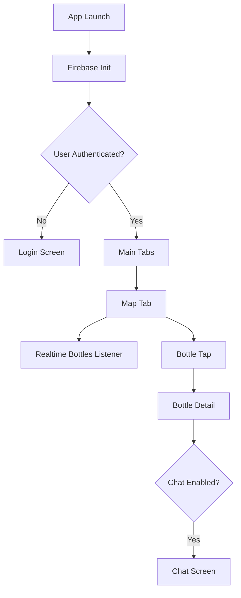
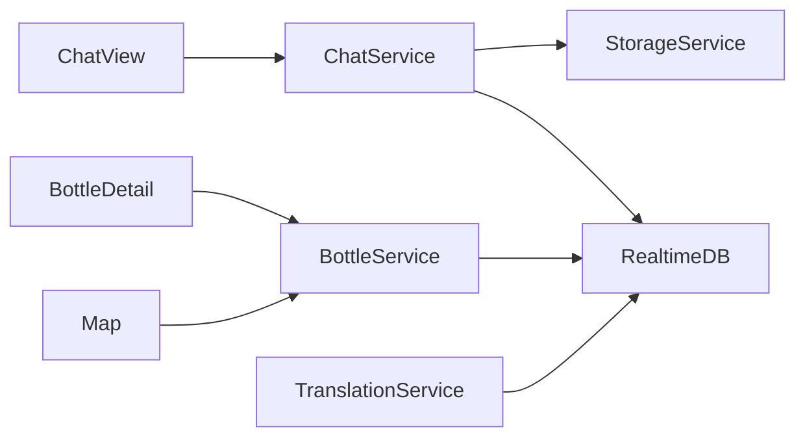
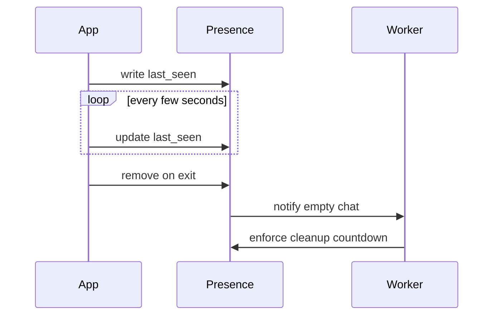

# **Drift iOS Application Architecture**


This document provides a structured, formal overview of the technical architecture of the **Drift iOS application**. It consolidates the product vision, app lifecycle, navigation model, service boundaries, Firebase integration strategy, and internal component responsibilities. This document excludes implementation code and focuses on structure, flow, and system responsibilities.


------


# **1. Overview**

**Drift** is an iOS application built around location-based ephemeral bottles. Each bottle contains text and optional media, is governed by unlocking conditions, and includes an ephemeral chat that survives only while users remain inside. The backend relies entirely on **Firebase Realtime Database**, **Firebase Storage**, and **Firebase Authentication**. A separate **Drift Worker (.NET service)** maintains lifecycle tasks and background processes.

This document defines the iOS app architecture, module responsibilities, data flow, and key interaction patterns.

------

# **2. High-Level Architecture**

The Drift iOS application is structured around five principal layers:

1. **Presentation Layer** (SwiftUI Views)
2. **Navigation Layer** (Coordinators & Tab Routing)
3. **State & Business Logic Layer** (ViewModels)
4. **Services Layer** (Firebase services, location service, translation service)
5. **Data Layer** (Realtime listeners, storage handlers, iOS caching primitives)

The application relies on reactive, listener-based flows rather than local databases.

------

# **3. Navigation Structure**

The application uses a **bottom tab bar** with three stable sections:

- **Map** – The primary interface, displaying all drifting bottles globally.
- **Messages** – Saved bottles, active chats, and event notifications.
- **Profile** – Account settings, statistics, entitlements, and preferences.

Navigation into “Bottle Detail” and “Chat” occurs as modal screens or stacked push screens.


------


# **4. Files & Directory Structure**


```
Drift/
├─ App/
│  ├─ DriftApp.swift                // App entry point
│  ├─ AppCoordinator.swift          // Root navigation manager
│  └─ Environment/
│     ├─ AppEnvironment.swift       // Shared singletons
│     └─ Config.swift               // Firebase project config
│
├─ Features/
│  ├─ Map/
│  │  ├─ MapView.swift
│  │  ├─ BottleAnnotationView.swift
│  │  ├─ MapViewModel.swift
│  │  └─ MapCoordinator.swift
│  │
│  ├─ Bottle/
│  │  ├─ BottleDetailView.swift
│  │  ├─ BottleCreationView.swift
│  │  ├─ BottleViewModel.swift
│  │  └─ BottleCreationViewModel.swift
│  │
│  ├─ Chat/
│  │  ├─ ChatView.swift
│  │  ├─ ChatMessageView.swift
│  │  ├─ ChatViewModel.swift
│  │  └─ ChatCoordinator.swift
│  │
│  ├─ Messages/
│  │  ├─ MessagesInboxView.swift
│  │  ├─ MessagesViewModel.swift
│  │  └─ SavedBottleRow.swift
│  │
│  ├─ Profile/
│  │  ├─ ProfileView.swift
│  │  ├─ SettingsView.swift
│  │  └─ ProfileViewModel.swift
│
├─ Services/
│  ├─ FirebaseAuthService.swift
│  ├─ RealtimeDatabaseService.swift
│  ├─ StorageService.swift
│  ├─ PresenceService.swift
│  ├─ BottleService.swift
│  ├─ ChatService.swift
│  ├─ TranslationService.swift
│  ├─ LocationService.swift
│  └─ NotificationService.swift
│
├─ Models/
│  ├─ User.swift
│  ├─ Bottle.swift
│  ├─ ChatMessage.swift
│  ├─ BottleOpener.swift
│  ├─ WatchedBottle.swift
│  ├─ WorkerInternal.swift
│  ├─ NotificationItem.swift
│  └─ Presence.swift
│
├─ Utilities/
│  ├─ Timestamp.swift
│  ├─ DistanceCalculator.swift
│  ├─ ImageCompressor.swift
│  ├─ AudioRecorder.swift
│  └─ Logger.swift
│
└─ Resources/
   ├─ Assets.xcassets
   ├─ Localizations/
   └─ AppIcons/
   
```


------


# **5. Core Application Components**


## **5.1 App Coordinator**


Responsible for:


- Initializing Firebase
- Checking authentication status
- Routing to Login or Main Tabs
- Managing deep links (future)


## **5.2 Map Feature**


Handles:


- Displaying global bottles
- Listening to /bottles changes
- Tap interactions and bottom sheet preview
- Initiating the “drop bottle” workflow


Uses:


- MapKit
- BottleService
- LocationService


## **5.3 Bottle Detail**


Handles:


- Unlock checks
- Displaying text/media
- Showing expiration and distance
- Transition to chat if enabled


## **5.4 Chat Feature**


Provides:


- Realtime listener on chats/{bottleId}
- Auto-translation of unread messages
- Media message sending (image/audio)
- Presence updates
- Lifecycle management (exit triggers worker countdown)


## **5.5 Messages Inbox**


Displays:


- Saved/watched bottles
- Active chats
- Notification queue


## **5.6 Profile Feature**


Displays:


- Chat color picker
- User avatar style
- Language
- Statistics
- Entitlements & premium state


------


# **6. Service Layer Responsibilities**


## **6.1 FirebaseAuthService**


- Handles login/logout
- Maintains current user
- Provides auth state listener


## **6.2 RealtimeDatabaseService**


- Generic read/write helper
- Strongly typed fetchers
- Attaches/detaches listeners


## **6.3 StorageService**


- Upload of images/audio
- Secure downloads
- Enforces Storage Rules


## **6.4 BottleService**


- Creation of bottles
- Live map querying
- Unlocking and opener registration


## **6.5 ChatService**


- Send messages
- Listen to message streams
- Maintain translation memory


## **6.6 PresenceService**


- Update presence/{bottleId}/{uid}
- Clean presence on app backgrounding


## **6.7 TranslationService**


- Uses on-device translation
- Writes missing translations


## **6.8 NotificationService**


- Reads notifications_queue/{uid}
- Surfaces to user


## **6.9 LocationService**


- Provides GPS readings


------


# **7. App Lifecycle Flow**


## **7.1 Startup**


1. App launches.
2. Firebase initializes.
3. AuthService checks login.
4. If logged in → show tab bar.
5. Map tab becomes active.


## **7.2 Map Loop**


1. Listen to /bottles.
2. Update annotations.
3. Handle taps.
4. Enter bottle detail.


## **7.3 Bottle Opening Flow**


1. Conditions evaluated locally (password/time/weather/location).
2. If unlocked → mark opener under bottle_openers/{bottleId}.
3. If chat enabled → option to enter chat.


## **7.4 Chat Loop**


1. Chat listener attaches to chats/{bottleId}.
2. PresenceService updates every few seconds.
3. Leaving chat removes presence.
4. Worker reacts to presence changes.


## **7.5 Backgrounding**


- Presence removed.
- Listeners detached.


------


# **8. Mermaid Diagrams**


## **8.1 High-Level App Flow**





## **8.2 Service Interaction**





## **8.3 Presence Lifecycle**





------


# **9. Summary**


This architecture provides:


- A stable, predictable structure for iOS development.
- Clear separation of concerns across presentation, state, and services.
- Full alignment with Firebase capabilities and constraints.
- Modular, scalable layout suitable for future Android and premium features.


The application remains map-centric, simple, and fully reactive through Firebase realtime listeners, ensuring an efficient and responsive user experience.